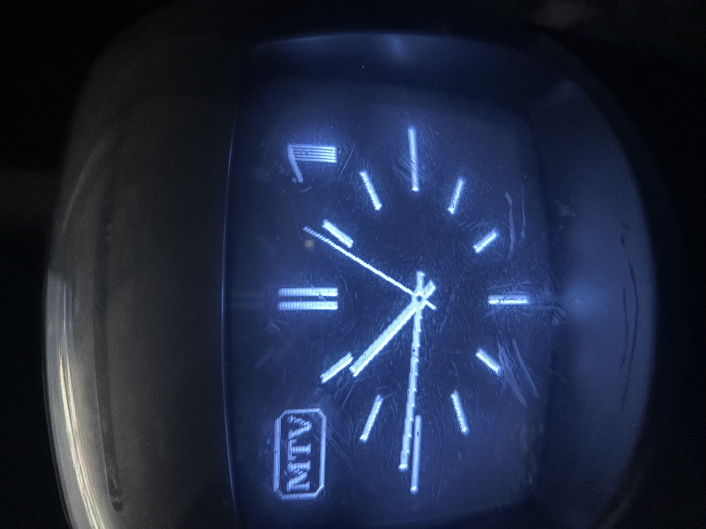

# MTV1 Clock for ESP32

A faithful recreation of the classic Hungarian MTV1 television clock from the late 1980s using an ESP32 with PAL composite video output.

  

## Features

- PAL composite video
- Authentic MTV1 analog clock
- Original startup test card
- NTP synchronization
- Automatic DST support
- Built-in Wi-Fi configuration portal
- Automatic Wi-Fi scanning
- No mobile app required

- Tested with ESP32 Arduino Core 2.0.14**
>
> The project was developed and tested using ESP32 Arduino Core **2.0.14**. Compatibility with newer core versions is not guaranteed.

## Hardware

- ESP32
- PAL composite output
- RCA connector
- PAL TV or monitor

## Wi-Fi Setup

On first boot the ESP32 creates:

**MTV1_SETUP**

Open:

http://192.168.4.1

Select your Wi-Fi network, enter the password and press Connect.

## License

MIT
